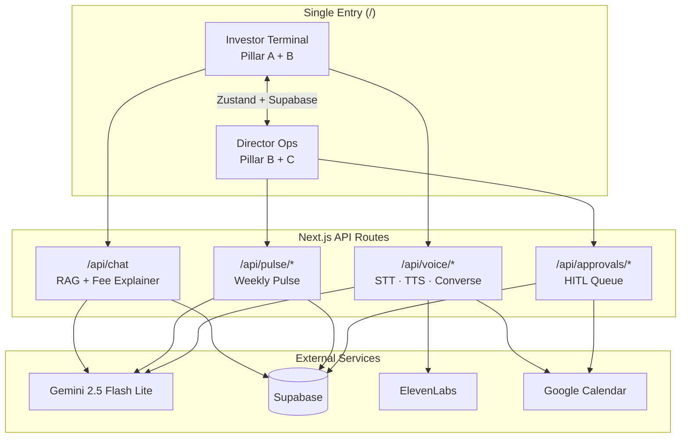

# Groww — Investor Ops & Intelligence Suite

**Status:** ✅ **Capstone complete** — Phases 1–16 implemented. Unified single-URL dashboard with Smart-Sync KB, theme-aware voice, and HITL Director Ops.

## Submission links

| Deliverable | Link |
| ----------- | ---- |
| **GitHub repository** | https://github.com/varungarg7119iitkgp-PMLearn/groww-investor-ops-intelligence-suite |
| **Deployed application (Vercel)** | https://groww-investor-ops-intelligence-sui.vercel.app |
| **Evals report (living)** | [`Evals_Report.md`](./Evals_Report.md) |
| **Final eval report (Phase 15)** | [`evals-report.md`](./evals-report.md) — **Overall gate: PASS ✅** |
| **Source manifest** | [`Source_Manifest.md`](./Source_Manifest.md) (30+ URLs) + [README section](#source-manifest) |
| **Demo video (5 min)** | Record per [`DEMO_VIDEO_SCRIPT.md`](./DEMO_VIDEO_SCRIPT.md) — *add your YouTube/Loom URL here before submission* |

### Eval summary (Phase 15 formal run)

| Suite | Target | Achieved |
| ----- | ------ | -------- |
| RAG Accuracy | ≥ 0.80 | **0.84** ✅ |
| Safety Compliance | 5/5 | **5/5** ✅ |
| UX Structure | 3/3 + theme | **PASS** ✅ |
| Cross-Pillar | 10/10 | **10/10** ✅ |

Run evals locally: `npm run eval:final` (see [Reproducibility](#reproducibility)).

---

## Architecture

Single Next.js 15 app — one URL, two modes (`investor-terminal` | `director-ops`):



**Cross-pillar flows:** pulse top theme → voice greeting · booking → approval queue · chat ↔ voice context · Zustand ↔ `shared_app_state` table.

Full 16-phase roadmap: [`Phase0_Planning/Capstone_architecture.md`](./Phase0_Planning/Capstone_architecture.md).

---

## Reproducibility

```bash
npm install
npm run dev          # http://localhost:3000
npm run build        # production build
npm test             # vitest (all phase tests)
npm run eval:final   # formal eval suite + evals-report.md
npx tsx scripts/verify-deliverables.ts
```

Copy [`.env.example`](./.env.example) → `.env.local` for full local features. The **deployed Vercel app** runs with pre-configured keys; mock/degrade paths apply when optional services are unavailable.

**Troubleshooting:** If API routes return 500 with `turbopack_runtime` errors, run `npm run clean && npm run build` — do not mix `dev:turbo` with production `start` without cleaning `.next` first.

---

### Prior milestone references (conceptual lineage only)

| Milestone | Role in unified suite | Repo | Demo |
| --------- | --------------------- | ---- | ---- |
| M1 — RAG Mutual Fund FAQ | Pillar A facts & citations | [mutual-fund-rag-chatbot](https://github.com/varungarg7119iitkgp-PMLearn/mutual-fund-rag-chatbot) | [Vercel](https://mutual-fund-rag-chatbot-psi.vercel.app/) |
| M2 — Weekly pulse / fee explainer | Pillar A fee logic + Pillars B & C context | [Groww-Support-PM-Pulsator](https://github.com/varungarg7119iitkgp-PMLearn/Groww-Support-PM-Pulsator) | [Vercel](https://groww-support-pm-pulsator.vercel.app/) |
| M3 — Voice appointment scheduler | Pillars B & C voice + MCP workflow | [voice-agent-concierge](https://github.com/varungarg7119iitkgp-PMLearn/voice-agent-concierge) | [Vercel](https://voice-agent-concierge.vercel.app/) |

---

Single **Investor Ops & Intelligence Suite** for a fintech-style operator:

1. **Pillar A — Smart-Sync Knowledge Base (M1 + M2):** Unified search answers that blend mutual-fund facts with fee explainer logic; **source citations** and **six-bullet structure** preserved.
2. **Pillar B — Insight-driven agent optimization (M2 + M3):** Weekly review pulse **themes** brief the voice agent; **theme-aware** greetings (e.g. nominee updates, login issues).
3. **Pillar C — Super-agent MCP workflow (M2 + M3):** One **human-in-the-loop (HITL)** approval center for MCP actions; post-call **calendar hold** + **advisor email draft** including **market / sentiment context** from the pulse.

**Technical constraints (target):** Single UI entry point (Streamlit, Gradio, master notebook, **or** this Next.js shell evolved into the dashboard); **no PII** (`[REDACTED]`); **state persistence** — booking reference visible in pulse / ops docs to prove cross-module linkage.

**Evaluations (required on final system):** Retrieval (faithfulness + relevance), constraint adherence (adversarial pass/fail), tone & structure (pulse rubric + voice “top theme” check). Details and templates: [`Evals_Report.md`](./Evals_Report.md).

---

## Local development

```bash
npm install
npm run dev
```

Open [http://localhost:3000](http://localhost:3000). Production build:

```bash
npm run build
npm start
```

---

## Source Manifest

**Requirement:** Req 17 — list **30+ URLs** of data sources, APIs, libraries, and references used across the capstone.  
**Last updated:** 2026-05-24 · **Total entries:** 90+ URLs · **Stored in:** this README + Supabase `funds`, `fund_chunks`, `fee_scenarios` tables.

This manifest maps every grounded citation, fee reference, voice preparation doc, external API, and framework dependency to its pillar in the unified suite:

| Pillar | Modules | Primary sources in this manifest |
| ------ | ------- | -------------------------------- |
| **A — Smart-Sync KB** | `/api/chat`, TF-IDF RAG, Fee Explainer | 20 AMC scheme pages · 100 Supabase chunks · 5 fee scenarios · SEBI/AMFI/IT rules |
| **B — Theme-aware voice** | `/api/voice/*`, Weekly Pulse | `weekly_pulses` (Supabase) · Groww help corpus · ElevenLabs STT/TTS |
| **C — HITL MCP workflow** | Approval queue, Calendar tool | Google Calendar API · pulse market-context snippets · Groww policy pages |

**Eval status (see [`Evals_Report.md`](./Evals_Report.md) + [`evals-report.md`](./evals-report.md)):** RAG **0.84** ✅ · Safety **5/5** ✅ · UX **3/3** ✅ · Cross-Pillar **10/10** ✅ · Phase 15 **PASS** ✅

---

### A. Capstone deliverables & prior milestone lineage

| # | Resource | URL | Used for |
| - | -------- | --- | -------- |
| 1 | Capstone repository | https://github.com/varungarg7119iitkgp-PMLearn/groww-investor-ops-intelligence-suite | Source code & submission |
| 2 | Deployed app (Vercel) | https://groww-investor-ops-intelligence-sui.vercel.app | Live demo |
| 3 | Evals report | [`Evals_Report.md`](./Evals_Report.md) | Golden dataset, adversarial tests, scores |
| 4 | Architecture spec | [`Phase0_Planning/Capstone_architecture.md`](./Phase0_Planning/Capstone_architecture.md) | 16-phase implementation roadmap |
| 5 | Requirements spec | [`Phase0_Planning/Capstone_requirements.md`](./Phase0_Planning/Capstone_requirements.md) | 17 requirements (master source of truth) |
| 6 | M1 — Mutual Fund RAG Chatbot | https://github.com/varungarg7119iitkgp-PMLearn/mutual-fund-rag-chatbot | Pillar A retrieval + citation patterns |
| 7 | M1 live demo | https://mutual-fund-rag-chatbot-psi.vercel.app/ | TF-IDF RAG reference |
| 8 | M2 — Groww Support PM Pulsator | https://github.com/varungarg7119iitkgp-PMLearn/Groww-Support-PM-Pulsator | Pulse, Fee Explainer, HITL patterns |
| 9 | M2 live demo | https://groww-support-pm-pulsator.vercel.app/ | Supabase schema lineage |
| 10 | M3 — Voice Agent Concierge | https://github.com/varungarg7119iitkgp-PMLearn/voice-agent-concierge | State machine + MCP tools |
| 11 | M3 live demo | https://voice-agent-concierge.vercel.app/ | Voice UX reference |

---

### B. Pillar A — 20-fund RAG universe (Supabase `funds.source_urls`)

Each fund is chunked into five RAG sections (`overview`, `performance`, `fees_loads`, `risk`, `news`) — **100 chunks total** — with citations pointing to the canonical AMC page below. Universe: 5 Debt · 5 Commodity · 5 Hybrid · 5 Equity.

| # | Fund ID | Fund name | Category | Canonical source URL |
| - | ------- | --------- | -------- | -------------------- |
| 12 | `hdfc-silv` | HDFC Silver ETF FoF | commodity | https://www.hdfcfund.com/our-products/exchange-traded-funds/hdfc-silver-etf-fof |
| 13 | `icici-silv` | ICICI Pru Silver ETF FoF | commodity | https://www.icicipruamc.com/silver-etf-fof |
| 14 | `axis-silv` | Axis Silver FoF | commodity | https://www.axismf.com/silver-fof |
| 15 | `nip-silv` | Nippon India Silver ETF FoF | commodity | https://mf.nipponindiaim.com/our-funds/silver-etf-fund-of-fund |
| 16 | `absl-silv` | Aditya Birla SL Silver ETF FoF | commodity | https://mutualfund.adityabirlacapital.com/aditya-birla-sun-life-silver-etf-fof |
| 17 | `dsp-cr` | DSP Credit Risk Fund | debt | https://www.dspim.com/funds/credit-risk-fund |
| 18 | `hsbc-cr` | HSBC Credit Risk Fund | debt | https://www.assetmanagement.hsbc.co.in/hsbc-credit-risk-fund |
| 19 | `absl-cr` | Aditya Birla SL Credit Risk Fund | debt | https://mutualfund.adityabirlacapital.com/aditya-birla-sun-life-credit-risk-fund |
| 20 | `absl-med` | Aditya Birla SL Medium Term Plan | debt | https://mutualfund.adityabirlacapital.com/aditya-birla-sun-life-medium-term-plan |
| 21 | `sbi-med` | SBI Magnum Medium Duration Fund | debt | https://www.sbimf.com/en/mutual-fund-schemes/income-funds/sbi-magnum-medium-duration-fund |
| 22 | `sbi-psu` | SBI PSU Fund Direct Growth | equity | https://www.sbimf.com/en/mutual-fund-schemes/equity-funds/sbi-psu-fund |
| 23 | `icici-psu` | ICICI Pru PSU Equity Fund | equity | https://www.icicipruamc.com/psu-equity-fund |
| 24 | `absl-psu` | Aditya Birla SL PSU Equity Fund | equity | https://mutualfund.adityabirlacapital.com/aditya-birla-sun-life-psu-equity-fund |
| 25 | `inv-psu` | Invesco India PSU Equity Fund | equity | https://www.invescomutualfund.com/psu-equity-fund |
| 26 | `mot-bse` | Motilal Oswal BSE Enhanced Value Index Fund | equity | https://www.motilaloswalmf.com/bse-enhanced-value-index-fund |
| 27 | `hdfc-hyb` | HDFC Hybrid Equity Fund | hybrid | https://www.hdfcfund.com/our-products/hybrid-funds/hdfc-hybrid-equity-fund |
| 28 | `hdfc-arb` | HDFC Income Plus Arbitrage Active FoF | hybrid | https://www.hdfcfund.com/our-products/fund-of-funds/hdfc-income-plus-arbitrage-active-fof |
| 29 | `icici-ret` | ICICI Pru Retirement Fund Hybrid Aggressive | hybrid | https://www.icicipruamc.com/retirement-fund-hybrid-aggressive |
| 30 | `nip-multi` | Nippon India Multi Asset Fund | hybrid | https://mf.nipponindiaim.com/our-funds/multi-asset-fund |
| 31 | `sbi-child` | SBI Magnum Children's Benefit Fund | hybrid | https://www.sbimf.com/en/mutual-fund-schemes/childrens-fund/sbi-magnum-childrens-benefit-fund |

**Retrieval config:** TF-IDF in-memory index (`src/tools/rag-retriever.ts`), topK = 5, model `gemini-2.5-flash-lite` (see Evals Report §9).

---

### C. Pillar A — Fee Explainer authoritative sources (Supabase `fee_scenarios`)

Each scenario returns **≤6 bullets** and **exactly 2 source URLs** (`src/tools/fee-explainer.ts`, `/api/fee-explainer`).

| # | Scenario | Source 1 | Source 2 |
| - | -------- | -------- | -------- |
| 32 | Expense ratio | https://www.sebi.gov.in/legal/regulations/sep-2024/securities-and-exchange-board-of-india-mutual-funds-regulations-1996-last-amended-on-september-26-2024-_87122.html | https://www.amfiindia.com/investor-corner/knowledge-center/types-of-mutual-fund-schemes.html |
| 33 | Exit load | https://www.amfiindia.com/investor-corner/knowledge-center/load-structure-mutual-fund.html | https://www.sebi.gov.in/sebi_data/attachdocs/jun-2024/exit_load_circulars.html |
| 34 | TCS (LRS) | https://www.incometax.gov.in/iec/foportal/help/tcs-on-lrs | https://taxguru.in/income-tax/tcs-on-foreign-remittance-under-lrs.html |
| 35 | Brokerage / transaction charges | https://www.amfiindia.com/investor-corner/knowledge-center/transaction-charges.html | https://www.sebi.gov.in/sebi_data/commondocs/jun-2024/distributor-commission-circular.pdf |
| 36 | Account maintenance (folio) | https://www.sebi.gov.in/sebi_data/attachdocs/oct-2024/bsda-revision-circular.pdf | https://www.amfiindia.com/investor-corner/knowledge-center/holding-mode.html |

---

### D. Pillar B — Voice preparation corpus (`src/tools/preparation-data.json`)

Used by the RAG Retriever tool (`get_preparation_docs`) for topic taxonomy: KYC · SIP · Statements · Withdrawals · Account Changes.

| # | Topic | Title | Source URL |
| - | ----- | ----- | ---------- |
| 37 | KYC | Documents required | https://groww.in/p/mutual-funds-kyc |
| 38 | KYC | Re-KYC / CKYC status | https://groww.in/p/ckyc-re-kyc |
| 39 | SIP | Start a SIP | https://groww.in/p/start-sip |
| 40 | SIP | Pause / stop / modify | https://groww.in/p/manage-sip |
| 41 | SIP | First-installment timing | https://groww.in/p/sip-first-debit |
| 42 | Statements | Download CAS | https://groww.in/p/download-cas |
| 43 | Statements | Capital gains statement | https://groww.in/p/capital-gains-statement |
| 44 | Withdrawals | Redeem units | https://groww.in/p/redeem-units |
| 45 | Withdrawals | Exit load & tax | https://groww.in/p/mutual-fund-taxation |
| 46 | Account changes | Update email / mobile | https://groww.in/p/update-contact |
| 47 | Account changes | Update nominee | https://groww.in/p/update-nominee |
| 48 | Account changes | Bank account update | https://groww.in/p/update-bank |

---

### E. India — regulators, tax & market infrastructure

Facts-only context for compliance guardrails, fee education, and citation fallbacks.

| # | Source | URL |
| - | ------ | --- |
| 49 | SEBI (main) | https://www.sebi.gov.in/ |
| 50 | SEBI Investor Portal | https://investor.sebi.gov.in/ |
| 51 | SEBI Investor Knowledge Base | https://investor.sebi.gov.in/knowledge-base.html |
| 52 | SEBI Investor FAQ | https://investor.sebi.gov.in/faq/faq.html |
| 53 | SEBI Circulars | https://www.sebi.gov.in/legal/circulars.html |
| 54 | SEBI Regulations | https://www.sebi.gov.in/legal/regulations.html |
| 55 | AMFI (main) | https://www.amfiindia.com/ |
| 56 | AMFI Investor Education | https://www.amfiindia.com/investor-corner/investor-education |
| 57 | AMFI Investor Handbook | https://www.amfiindia.com/investor-center/investor-handbook |
| 58 | AMFI Arrival / Departure of Funds | https://www.amfiindia.com/investor-corner/online-center/arrival-departure-of-funds |
| 59 | AMFI Certification (intermediary) | https://www.amfiindia.com/intermediary/students/certification.html |
| 60 | RBI (main) | https://www.rbi.org.in/ |
| 61 | RBI Notifications | https://www.rbi.org.in/commonperson/English/Scripts/rbi_notifications.aspx |
| 62 | Income Tax Portal | https://www.incometax.gov.in/iec/foportal/ |
| 63 | Income Tax — ELSS | https://www.incometax.gov.in/iec/foportal/help/how-to-save-tax/elss |
| 64 | NPCI | https://www.npci.org.in/ |
| 65 | NSE India | https://www.nseindia.com/ |
| 66 | NSE — About investors | https://www.nseindia.com/invest/content/about_us.htm |
| 67 | BSE India | https://www.bseindia.com/ |
| 68 | BSE — About investors | https://www.bseindia.com/investors/about/about_us.aspx |
| 69 | CCIL | https://www.ccilindia.com/ |

---

### F. Groww platform — policy, help & pricing

| # | Source | URL |
| - | ------ | --- |
| 70 | Groww Help Centre | https://groww.in/help/ |
| 71 | Privacy Policy | https://groww.in/privacy-policy |
| 72 | Terms & Conditions | https://groww.in/terms-and-conditions |
| 73 | Pricing / charges | https://groww.in/pricing |

---

### G. RTAs & registrar reference

| # | Source | URL |
| - | ------ | --- |
| 74 | CAMS — investor education | https://www.camsonline.com/DistributorsServices/Education/Default.aspx |
| 75 | KFin Technologies — investor services | https://www.kfintech.com/investor-services/ |

---

### H. External APIs & cloud services

| # | Service | Documentation / endpoint | Used in |
| - | ------- | ------------------------ | ------- |
| 76 | Google Gemini API | https://ai.google.dev/gemini-api/docs | Smart-Sync KB, Pulse generation, voice orchestration |
| 77 | `@google/generative-ai` SDK | https://www.npmjs.com/package/@google/generative-ai | `src/lib/gemini.ts` |
| 78 | ElevenLabs TTS | https://api.elevenlabs.io/v1/text-to-speech | `src/app/api/voice/tts/route.ts` |
| 79 | ElevenLabs STT | https://api.elevenlabs.io/v1/speech-to-text | `src/app/api/voice/stt/route.ts` |
| 80 | ElevenLabs docs | https://elevenlabs.io/docs | Voice agent (Pillar B) |
| 81 | Google Calendar API v3 | https://developers.google.com/calendar/api/v3/reference | `src/tools/calendar.ts` (Pillar C) |
| 82 | Google APIs Node client | https://www.npmjs.com/package/googleapis | Service-account calendar holds |
| 83 | Supabase | https://supabase.com/docs | PostgreSQL — funds, chunks, reviews, pulses, approvals, eval_results |
| 84 | `@supabase/supabase-js` | https://www.npmjs.com/package/@supabase/supabase-js | `src/lib/supabase.ts`, `src/lib/data.ts` |
| 85 | Vercel deployment | https://vercel.com/docs | Serverless hosting + CRON |

**Environment variables:** see [`.env.example`](./.env.example) — `GEMINI_API_KEY`, Supabase keys, ElevenLabs keys, Google Calendar service account.

---

### I. Frameworks, libraries & tooling

| # | Package / tool | URL | Role |
| - | -------------- | --- | ---- |
| 86 | Next.js 15 (App Router) | https://nextjs.org/docs | SSR, API routes, dual-mode UI |
| 87 | React 19 | https://react.dev/ | Component layer |
| 88 | TypeScript | https://www.typescriptlang.org/docs/ | Type system (`src/types/index.ts`) |
| 89 | Tailwind CSS 4 | https://tailwindcss.com/docs | Stark-Glass HUD styling |
| 90 | Framer Motion | https://www.framer.com/motion/ | Orb states, scanning line, panel animations |
| 91 | Zustand | https://zustand.docs.pmnd.rs/ | Cross-pillar global state |
| 92 | Vitest | https://vitest.dev/ | Phase unit + eval tests |
| 93 | fast-check | https://fast-check.dev/ | Property-based tests (state machine, PII) |
| 94 | Lucide React | https://lucide.dev/ | Icon set |

---

### J. Design & typography references

| # | Reference | URL |
| - | --------- | --- |
| 95 | Inter (Google Fonts) | https://fonts.google.com/specimen/Inter |
| 96 | Inter Tight (Google Fonts) | https://fonts.google.com/specimen/Inter+Tight |
| 97 | JetBrains Mono (Google Fonts) | https://fonts.google.com/specimen/JetBrains+Mono |
| 98 | Palantir Gotham (Director Ops aesthetic inspiration) | https://www.palantir.com/platforms/gotham/ |

Design tokens: `src/app/globals.css` · motion variants: `src/lib/animations.ts` · spec: `Phase0_Planning/Capstone_ui-ux-requirements.md`.

---

### K. Evaluation reproducibility

Golden dataset, adversarial prompts, and UX rubric are defined in [`Evals_Report.md`](./Evals_Report.md) and [`Phase0_Planning/Capstone_architecture.md`](./Phase0_Planning/Capstone_architecture.md) (AI Eval Gates).

| # | Artifact | Command / location |
| - | -------- | ------------------ |
| 99 | RAG eval (5 golden questions) | `npx tsx scripts/eval-rag.ts` |
| 100 | Safety eval (3 adversarial + 2 edge) | `npx vitest run Phase9 Phase11/__tests__/phase11-safety-evals.test.ts` |
| 101 | UX structure eval (pulse rubric) | `npx tsx scripts/eval-ux.ts` |
| 102 | Eval results store | Supabase `public.eval_results` |
| 103 | LLM judge rubric | `src/lib/eval-utils.ts` |
| 104 | Compliance patterns | `src/lib/compliance.ts` |

**Latest formal scores (2026-05-24):** RAG Faithfulness mean **0.82** · Relevance mean **0.86** · Aggregate **0.84** · Safety **5/5 PASS**.

---

## Repository layout

```
├── Phase0_Planning/          # Architecture, requirements, UI/UX specs
├── Phase1–Phase12/           # Phase deliverables, tests, completion reports
├── src/
│   ├── app/                  # Next.js App Router (/, /director-ops, API routes)
│   ├── components/           # Investor Terminal + Director Ops + shared UI
│   ├── hooks/                # Voice, conversation, audio analyzer
│   ├── lib/                  # Data layer, compliance, prompts, store, eval utils
│   └── tools/                # RAG, fee explainer, calendar, preparation corpus
├── scripts/                  # eval-rag.ts, eval-ux.ts, eval-runner.ts
├── Evals_Report.md           # Formal evaluation results
├── README.md                 # This file + Source Manifest
└── vercel.json               # Vercel deployment config
```

---

## License

Educational capstone scaffold — adjust license when you publish.
