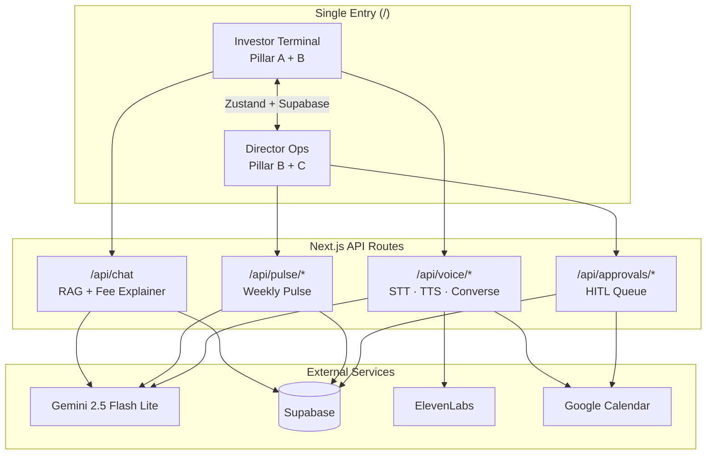

# Groww — Investor Ops & Intelligence Suite

**Status:** ✅ **Capstone complete** — Phases 1–16 implemented. Unified single-URL dashboard with Smart-Sync KB, theme-aware voice, and HITL Director Ops.

## Submission links

| Deliverable | Link |
| ----------- | ---- |
| **GitHub repository** | https://github.com/varungarg7119iitkgp-PMLearn/groww-investor-ops-intelligence-suite |
| **Deployed application (Vercel)** | https://groww-investor-ops-intelligence-sui.vercel.app |
| **Evals report (living)** | [`Evals_Report.md`](./Evals_Report.md) |
| **Final eval report (Phase 15)** | [`evals-report.md`](./evals-report.md) — **Overall gate: PASS ✅** |
| **Source manifest** | [`Source_Manifest.md`](./Source_Manifest.md) (30+ URLs) + [README section](#source-manifest) |
| **Demo video (5 min)** | Record per [`DEMO_VIDEO_SCRIPT.md`](./DEMO_VIDEO_SCRIPT.md) — *add your YouTube/Loom URL here before submission* |

### Eval summary (Phase 15 formal run)

| Suite | Target | Achieved |
| ----- | ------ | -------- |
| RAG Accuracy | ≥ 0.80 | **0.84** ✅ |
| Safety Compliance | 5/5 | **5/5** ✅ |
| UX Structure | 3/3 + theme | **PASS** ✅ |
| Cross-Pillar | 10/10 | **10/10** ✅ |

Run evals locally: `npm run eval:final` (see [Reproducibility](#reproducibility)).

---

## Architecture

Single Next.js 15 app — one URL, two modes (`investor-terminal` | `director-ops`):



**Cross-pillar flows:** pulse top theme → voice greeting · booking → approval queue · chat ↔ voice context · Zustand ↔ `shared_app_state` table.

Full 16-phase roadmap: [`Phase0_Planning/Capstone_architecture.md`](./Phase0_Planning/Capstone_architecture.md).

---

## Reproducibility

```bash
npm install
npm run dev          # http://localhost:3000
npm run build        # production build
npm test             # vitest (all phase tests)
npm run eval:final   # formal eval suite + evals-report.md
npx tsx scripts/verify-deliverables.ts
```

Copy [`.env.example`](./.env.example) → `.env.local` for full local features. The **deployed Vercel app** runs with pre-configured keys; mock/degrade paths apply when optional services are unavailable.

**Troubleshooting:** If API routes return 500 with `turbopack_runtime` errors, run `npm run clean && npm run build` — do not mix `dev:turbo` with production `start` without cleaning `.next` first.

---

### Prior milestone references (conceptual lineage only)

| Milestone | Role in unified suite | Repo | Demo |
| --------- | --------------------- | ---- | ---- |
| M1 — RAG Mutual Fund FAQ | Pillar A facts & citations | [mutual-fund-rag-chatbot](https://github.com/varungarg7119iitkgp-PMLearn/mutual-fund-rag-chatbot) | [Vercel](https://mutual-fund-rag-chatbot-psi.vercel.app/) |
| M2 — Weekly pulse / fee explainer | Pillar A fee logic + Pillars B & C context | [Groww-Support-PM-Pulsator](https://github.com/varungarg7119iitkgp-PMLearn/Groww-Support-PM-Pulsator) | [Vercel](https://groww-support-pm-pulsator.vercel.app/) |
| M3 — Voice appointment scheduler | Pillars B & C voice + MCP workflow | [voice-agent-concierge](https://github.com/varungarg7119iitkgp-PMLearn/voice-agent-concierge) | [Vercel](https://voice-agent-concierge.vercel.app/) |

---

Single **Investor Ops & Intelligence Suite** for a fintech-style operator:

1. **Pillar A — Smart-Sync Knowledge Base (M1 + M2):** Unified search answers that blend mutual-fund facts with fee explainer logic; **source citations** and **six-bullet structure** preserved.
2. **Pillar B — Insight-driven agent optimization (M2 + M3):** Weekly review pulse **themes** brief the voice agent; **theme-aware** greetings (e.g. nominee updates, login issues).
3. **Pillar C — Super-agent MCP workflow (M2 + M3):** One **human-in-the-loop (HITL)** approval center for MCP actions; post-call **calendar hold** + **advisor email draft** including **market / sentiment context** from the pulse.

**Technical constraints (target):** Single UI entry point (Streamlit, Gradio, master notebook, **or** this Next.js shell evolved into the dashboard); **no PII** (`[REDACTED]`); **state persistence** — booking reference visible in pulse / ops docs to prove cross-module linkage.

**Evaluations (required on final system):** Retrieval (faithfulness + relevance), constraint adherence (adversarial pass/fail), tone & structure (pulse rubric + voice “top theme” check). Details and templates: [`Evals_Report.md`](./Evals_Report.md).

---

## Local development

```bash
npm install
npm run dev
```

Open [http://localhost:3000](http://localhost:3000). Production build:

```bash
npm run build
npm start
```

---

## Source Manifest

**Requirement 17 — 30+ URLs of data sources, APIs, libraries, and references.**

The complete, self-contained source manifest now lives in
[**`Source_Manifest.md`**](./Source_Manifest.md) — **145 numbered entries** across
14 categories (capstone deliverables, milestone lineage, 20-fund Groww universe,
AMC factsheets, Fee Explainer scenarios, voice prep corpus, Groww platform pages,
India regulators, registrars, external APIs, frameworks, refresh pipeline, design
references, and production-route dependency map).

| Pillar | Modules | Primary sources |
| ------ | ------- | --------------- |
| **A — Smart-Sync KB** | `/api/chat`, TF-IDF RAG, Fee Explainer | 20 Groww fund pages · 20 AMC factsheets · 100 Supabase chunks · 5 fee scenarios · SEBI/AMFI/IT |
| **B — Theme-aware voice** | `/api/voice/*`, Weekly Pulse | `weekly_pulses` · 12 Groww help articles · Web Speech API · ElevenLabs |
| **C — HITL MCP workflow** | Approval queue, Calendar tool | Google Calendar API · Gmail SMTP · pulse market-context · Groww policy pages |

**Eval status (see [`Evals_Report.md`](./Evals_Report.md) + [`evals-report.md`](./evals-report.md)):** RAG **0.84** ✅ · Safety **5/5** ✅ · UX **3/3** ✅ · Cross-Pillar **10/10** ✅ · Phase 15 **PASS** ✅

---

**For the full 145-entry breakdown — including all 20 Groww canonical
URLs, 20 AMC factsheet URLs, 5 Fee Explainer scenarios with two sources
each, the Phase-17 daily refresh pipeline, and the production-route
dependency map — see [`Source_Manifest.md`](./Source_Manifest.md).**

Quick deep-links into the standalone manifest:

| Section | What's in it |
| ------- | ------------ |
| [§C — 20-fund RAG universe](./Source_Manifest.md#c-pillar-a--20-fund-rag-universe) | Groww canonical pages, AMC factsheets, AMC family pages |
| [§D — Fee Explainer sources](./Source_Manifest.md#d-pillar-a--fee-explainer-authoritative-sources) | 5 scenarios × 2 sources |
| [§E — Voice preparation corpus](./Source_Manifest.md#e-pillar-b--voice-preparation-corpus-srctoolspreparation-datajson) | 12 Groww help articles |
| [§G — India regulators & tax](./Source_Manifest.md#g-india-regulators-tax--market-infrastructure) | SEBI · AMFI · RBI · IT · NSE / BSE / NPCI / CCIL |
| [§I — External APIs](./Source_Manifest.md#i-external-apis--cloud-services-production-runtime) | Gemini · ElevenLabs · Calendar · Supabase · Vercel |
| [§K — Daily refresh pipeline](./Source_Manifest.md#k-daily-refresh-pipeline-phase-17) | GitHub Actions cron + scrape script |
| [§N — Eval reproducibility](./Source_Manifest.md#n-eval-reproducibility) | All `npm run eval:*` commands |

---

## Repository layout

```
├── Phase0_Planning/          # Architecture, requirements, UI/UX specs
├── Phase1–Phase12/           # Phase deliverables, tests, completion reports
├── src/
│   ├── app/                  # Next.js App Router (/, /director-ops, API routes)
│   ├── components/           # Investor Terminal + Director Ops + shared UI
│   ├── hooks/                # Voice, conversation, audio analyzer
│   ├── lib/                  # Data layer, compliance, prompts, store, eval utils
│   └── tools/                # RAG, fee explainer, calendar, preparation corpus
├── scripts/                  # eval-*.ts, refresh-funds-from-groww.ts (Phase 17 cron)
├── .github/workflows/        # daily-nav-refresh.yml (Groww scrape cron)
├── Evals_Report.md           # Formal evaluation results
├── Source_Manifest.md        # Single source of truth: 145 URLs across 14 categories
├── README.md                 # This file (overview + deep links into manifest)
└── vercel.json               # Vercel deployment config
```

---

## License

Educational capstone scaffold — adjust license when you publish.
